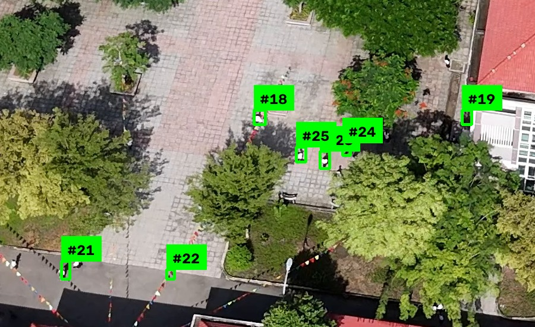

# SAR Small-Person Detector

A search-and-rescue-style aerial detector: finds small/distant people in
drone video, tracks them across frames so the same person isn't
double-counted, and keeps an "intel log" of every new person spotted
(timestamp, location in frame, and a saved snapshot crop).

This repo started with the standard small-object playbook: slice the frame,
run YOLO on each tile, then track detections over time. That works for many
aerial videos, but it breaks down once the drone climbs high enough that a
person is only a handful of pixels. The current pipeline exists because the
failure mode was not really "the tile size is wrong"; it was "the subject is
below the representation the detector was trained to see." The fix was to
stop treating the image as a flat grid and instead behave more like a SAR
operator: scan wide, zoom only where something lives, then confirm that it
persists.

Built on the same stack as the rest of this portfolio — `ultralytics` YOLO
+ `supervision` — plus four pieces that are new to this project:

- **Tiled inference** (`sv.InferenceSlicer`): drone footage is high
  resolution with tiny subjects; running YOLO on the whole frame at once
  would downscale people to almost nothing. The slicer runs the model on
  overlapping tiles instead and merges the results.
- **Scout → zoom inference** (`scout_zoom.py`): a cheap motion pass finds a
  handful of candidate ROIs, those chips are explicitly upsampled before
  YOLO sees them, and the pipeline falls back to tiled full-frame inference
  on a fixed interval as a safety net.
- **Multi-object tracking** (`ByteTrackTracker`, from the `trackers`
  package): assigns a stable ID to each person across frames, so "new
  person spotted" fires once per person, not once per frame.
- **Pixel-to-ground pinning** (`geo.py`): when telemetry is available, a
  confirmed track's pixel location is raycast onto the ground to produce a
  lat/lon with an honest error radius, turning a box into a map pin instead
  of just a frame coordinate. A box in a video frame tells a reviewer
  something was seen; a lat/lon is what a ground team can actually walk to,
  so this closes the gap between "detected" and "actionable."

## Why this approach exists

At high elevation, a person is often only 4 to 15 pixels tall in the full
frame. That creates a different problem than ordinary object detection:

- A 160 to 320 pixel tile can still contain a person that occupies roughly 1%
  of the tile.
- The smallest standard YOLO feature head is not built for reliably
  representing 4-pixel blobs after repeated downsampling.
- Most of a 4K search frame is empty terrain, so uniform tiling spends most of
  its budget on negative space.
- A raw crop around an 8-pixel detection is usually not useful for a human
  reviewer either.

That is why the pipeline now combines motion scouting, explicit zoom on
candidate chips, and stricter temporal confirmation. Each stage solves a
different part of the high-altitude problem:

- Scout reduces the amount of terrain that needs expensive inference.
- Zoom makes tiny people larger before YOLO sees them.
- Track confirmation keeps single-frame speckles from being logged as real
  sightings.

## Scout -> Zoom -> Confirm

The live detection loop now follows this pattern:

```text
full frame
   |
   v
1. SCOUT   frame differencing finds compact moving ROIs
   |
   v
2. ZOOM    each ROI is padded, cropped, and upsampled before YOLO inference
   |
   v
3. CONFIRM detections are merged back into full-frame coordinates
   |
   v
4. TRACK   ByteTrack keeps only persistent targets as stable IDs
```

In code, that means:

- `scout_zoom.py` runs a cheap grayscale `absdiff` against the previous frame,
  thresholds the residual, dilates it, and converts compact blobs into ROIs.
- Each ROI is padded and resized with cubic interpolation before it reaches
  YOLO, so a tiny target gets more usable pixels.
- The fallback slicer still runs periodically, which keeps the system from
  becoming blind to static or slow targets that motion scouting may miss.
- `ByteTrackTracker` only promotes detections that survive for multiple frames,
  so the intel log reflects persistent tracks rather than one-frame noise.

## Methodology

The method came from observing what was failing in zoomed-out aerial footage.
Uniform tiling was already the correct class of solution for ordinary small
objects, but the misses at high elevation showed that the bottleneck was not
only spatial coverage. It was scale, sparsity, and temporal ambiguity:

- Scale: a person was too small in the original frame for a stock detector to
  describe well.
- Sparsity: most tiles were empty, so compute was being spent on terrain rather
  than the few places that mattered.
- Temporal ambiguity: one weak box in one frame was not enough to call a real
  sighting.

That led directly to the current design:

- use motion as a cheap prior for where to spend inference
- use digital zoom only on those candidate regions
- require persistence over time before declaring a new target

This is also closer to how a human search operator works in practice: scan the
scene broadly, zoom into suspicious movement, and only trust a target after it
stays consistent across multiple frames.

## Altitude-aware sizing

If the drone altitude and camera field of view are known, you can estimate how
tall a standing person appears in pixels:

$$
p_{x} \approx \frac{1.7 \cdot H_{img}}{2 \cdot h \cdot \tan(\mathrm{fov}/2)}
$$

Where:

- `1.7` is an approximate person height in meters
- `H_img` is the image height in pixels
- `h` is the drone altitude above ground in meters
- `fov` is the vertical field of view in radians

This matters because the inference mode should change with expected target
size:

| Person size in frame | Recommended strategy |
| --- | --- |
| `> 40 px` | Full frame or large tiles; no extra zoom needed |
| `15-40 px` | Moderate tiling and mild upsample |
| `5-15 px` | Scout plus 2x to 4x zoom chips |
| `< 5 px` | Lean on motion and persistence; single-frame boxes are unreliable |

The CLI defaults are conservative, but for high-elevation footage the useful
controls are usually `--zoom-factor`, `--imgsz`, `--slice-wh`,
`--scout-min-area`, and `--scout-max-area`.

## Example

Real output on a high-altitude drone frame (a stock, non-fine-tuned
`yolo11n.pt` restricted to the "person" class, `--slice-wh 320 --overlap-wh
60 --confidence 0.1`). Each green box is one detection with its track ID —
note how small the people are at this altitude, which is exactly the
problem tiled inference and fine-tuning both exist to solve:



## Project layout

- `main.py` — the local inference pipeline: loads a model, slices+tracks a
  video file, writes an annotated output video, and saves the intel log.
- `detector_utils.py` — the two pieces of logic worth unit-testing on their
  own: filtering detections down to classes you care about, and deciding
  whether a tracked ID is genuinely new.
- `scout_zoom.py` — motion-gated ROI scouting and explicit zoomed inference.
- `geo.py` — flat-earth pixel-to-ground raycast, GSD, and error-radius math.
- `intel_log.py` — records each new-person event and exports it to CSV, plus
  GeoJSON/GPX when a track has a ground pin.
- `train_colab.py` — a cell-by-cell script (paste into Google Colab) for
  fine-tuning a YOLO model on an aerial person-detection dataset, optionally
  re-tiling the training images first with `TrainingSlicer`.
- `example_detection.jpg` — the screenshot above.

## Quickstart (works today, no fine-tuning required)

This runs end-to-end with a stock pretrained YOLO model restricted to the
"person" class, so you can see the whole pipeline — tiling, tracking,
intel logging — before investing time in fine-tuning.

```powershell
uv venv .venv
.venv\Scripts\activate
uv pip install -r requirements.txt

python main.py --source drone_video.mp4 --output annotated.mp4 --classes person
```

For zoomed-out live or high-altitude footage, the default path is now the
scout pipeline. Disable it with `--no-scout` if you want the older
"slice every frame" behavior.

For the current high-elevation test video in this repo, a practical starting
command is:

```powershell
python main.py --source drone_video.mp4 --classes person --confidence 0.15 --zoom-factor 3 --imgsz 1280 --slice-wh 320 --overlap-wh 60 --stride 15
```

Outputs:
- `annotated.mp4` — the video with green boxes, track IDs, and a running
  "in view / total found" counter drawn on it.
- `intel_log.csv` — one row per newly-spotted person.
- `snapshots/` — one cropped image per newly-spotted person.

If you also provide telemetry, every confirmed track can be projected to a
ground pin and exported as map-ready files:

```powershell
python main.py --source drone_video.mp4 --telemetry telemetry.csv
```

Telemetry rows are matched by `timestamp_sec` and should include:

```text
timestamp_sec,lat,lon,agl_m,heading_deg,gimbal_pitch_deg,gimbal_yaw_deg,hfov_deg
0.0,39.0901,-77.5380,180,42,8,0,70
```

When telemetry is present, the pipeline still writes the CSV but also emits:

- `intel_log.geojson` — pinned detections for GIS tools such as QGIS or geojson.io
- `intel_log.gpx` — waypoints for field tools such as Gaia or CalTopo

New CSV columns are appended only when a pin can be computed:

- `lat`, `lon`
- `agl_m`, `gsd_cm`
- `err_radius_m`

Telemetry is entirely optional and nothing else in the pipeline depends on
it: without `--telemetry`, every confirmed track still gets a box, a
snapshot, and a CSV row exactly as before — the new `lat`/`lon`/`agl_m`/
`gsd_cm`/`err_radius_m` columns are simply left blank, and no `.geojson` or
`.gpx` files are written. There is no live GPS feed requirement to run this
tool at all.

## Improving accuracy: fine-tune on aerial data

A stock YOLO model was trained on ground-level photos, so it under-performs
on the aerial viewpoint and tiny subjects a SAR drone actually sees. Open
`train_colab.py` in Google Colab (free GPU) to fine-tune on a public aerial
person-detection dataset from [Roboflow Universe](https://universe.roboflow.com),
then point `main.py` at the resulting `best.pt`:

```powershell
python main.py --source drone_video.mp4 --model best.pt --classes person
```

## Useful flags

| Flag | Default | Purpose |
| --- | --- | --- |
| `--slice-wh` | 640 | Tile size for `InferenceSlicer`. Smaller tiles help with more distant/smaller people, at the cost of more inference calls per frame. |
| `--overlap-wh` | 100 | Overlap between tiles, so a person straddling a tile boundary is still detected whole in the neighboring tile. |
| `--zoom-factor` | 3.0 | Explicit cubic upsample factor applied before YOLO sees a tile or motion ROI. |
| `--imgsz` | 640 | YOLO input size. Raising this to `1280` helps if the model was trained for higher-resolution inference. |
| `--scout` | on | Uses frame differencing to find likely ROIs and only zoom-infers on those chips, with a periodic full sliced pass as a safety net. |
| `--scout-min-area` / `--scout-max-area` | 8 / 900 | Pixel-area band for motion blobs worth zooming into. This is the main knob for matching the scout stage to expected person size at a given altitude. |
| `--scout-fallback-interval` | 30 | Forces an occasional full sliced pass so static or low-motion targets are not ignored forever. |
| `--tracker-min-frames` | 3 | Minimum persistence before a target is logged as a real sighting. |
| `--telemetry` | unset | Optional CSV with per-timestamp camera pose data for projecting detections to ground pins. |
| `--hfov` | 70 | Default horizontal field of view used when telemetry rows omit `hfov_deg`. |
| `--geojson` / `--gpx` | auto | Optional output paths for pinned detections; default to the intel CSV stem when telemetry is provided. |
| `--stride` | 1 | Process every Nth frame. Raise this (e.g. `15`-`60`) on CPU to keep up with long or high-resolution footage — the tracker's `timestamp` handling keeps counts and timing correct even when frames are skipped. |
| `--confidence` | 0.25 | Minimum detection confidence. |
| `--device` | cpu | `cuda` or `cuda:0` if you have a GPU available locally (check with `nvidia-smi`). |

## Troubleshooting: nothing gets detected

If `intel_log.csv` comes back empty and `annotated.mp4` has no boxes at
all, the most likely cause is tile size vs. footage: at the default
`--slice-wh 640`, a video that's high-altitude, high-resolution, or
already narrower than 640px effectively gets **zero tiling** — the model
sees the whole frame at once, and people at real SAR altitudes are only a
handful of pixels, well below what a stock detector can recognize.

Fixes, cheapest first:
- Lower `--confidence` (e.g. `0.1`) — costs nothing extra, sometimes enough
  on its own.
- Shrink `--slice-wh` (try `320`, then `160`) or raise `--zoom-factor` — each
  tile or ROI then occupies far more of what the model actually sees. This is
  slower: smaller tiles mean more inference calls per frame, and larger zoom
  factors make each inference heavier.
- Always pair a small `--slice-wh` with `--stride 15` or higher on CPU —
  otherwise a single 4K video can take well over an hour to process.
- Tune `--scout-min-area` and `--scout-max-area` if the motion scout is either
  missing tiny walkers or firing on broad terrain shimmer.
- Expect some false positives (tree canopy, rooftop clutter) once tiles get
  small — a stock model wasn't trained on this viewpoint. That gap is
  exactly what `train_colab.py`'s fine-tuning step is for.

## How "new person spotted" is decided

`ByteTrackTracker` gives every detection a `tracker_id`. A brand new track
starts at `tracker_id == -1` ("unconfirmed") and only gets a real ID once it
has matched for `minimum_consecutive_frames` in a row. The default is now `3`,
which is slightly stricter than the old behavior and better aligned with the
idea that tiny high-altitude detections should survive more than one match
before they become an intel event. `main.py` only logs and draws confirmed
tracks, and logs each one exactly once, the first frame it becomes confirmed.

## Roadmap: detection is the first 20%

A SAR tool becomes operationally useful when it also tells the crew where to
go, what has already been covered, and what is worth a zoom. Pixel-to-ground
pinning (above) is the first slice of that; the rest is not implemented yet:

- **Been-there coverage map** — a ground-projected grid that only marks a
  cell "searched" once `person_px` at that altitude clears the detection
  floor, so a zoomed-out pass does not falsely count as covered.
- **Lost-person search prior** — bias scout/zoom toward high-probability
  terrain (downhill, trails, clearing edges) instead of scanning uniformly.
- **Thermal + RGB fusion** — scout on thermal, confirm on RGB, for real
  high-altitude and night performance.
- **Reject memory ("not a rock")** — suppress a GPS cell and chip appearance
  hash after an operator rejects it, and feed rejects into the next
  fine-tune.
- **Operator accept/reject review UI** — a keystroke-driven loop (`A`/`R`/`Z`/`N`)
  so a human confirms every find and generates labeled data for free.
- **Active gimbal zoom** — when a track persists but stays small, slew/zoom/
  descend for one identifying pass, then climb back to search altitude.
- **Revisit / change detection** — align repeat passes over the same grid and
  highlight new compact blobs, catching people who were sitting still.
- **Secondary SAR object classes** — tent/tarp, backpack, vehicle, high-vis
  clothing, and water/trail corridors as search context, not just "person."
- **Track-through-canopy ghosting** — keep a predicted position for a lost
  track for a few seconds so re-acquisition reuses the same ID.
- **Honest confidence recalibration** — scale reported confidence by target
  size and track age so the operator isn't chasing single-frame noise.
- **SITREP export** — a one-page PDF/ATAK-style summary on top of the
  existing CSV/GeoJSON/GPX exports.
- **Synthetic tiny-people training data** — paste tiny-person cutouts onto
  real terrain frames to train on the 4-25px scale this footage actually has.
